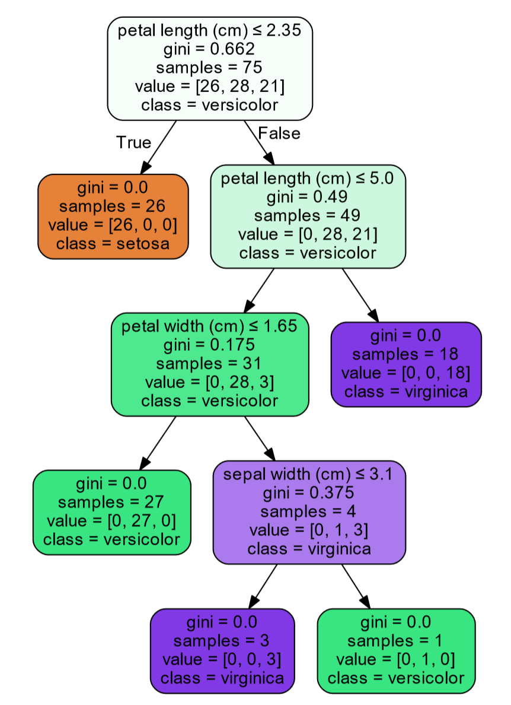
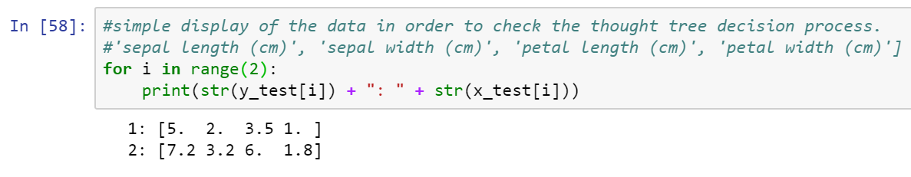
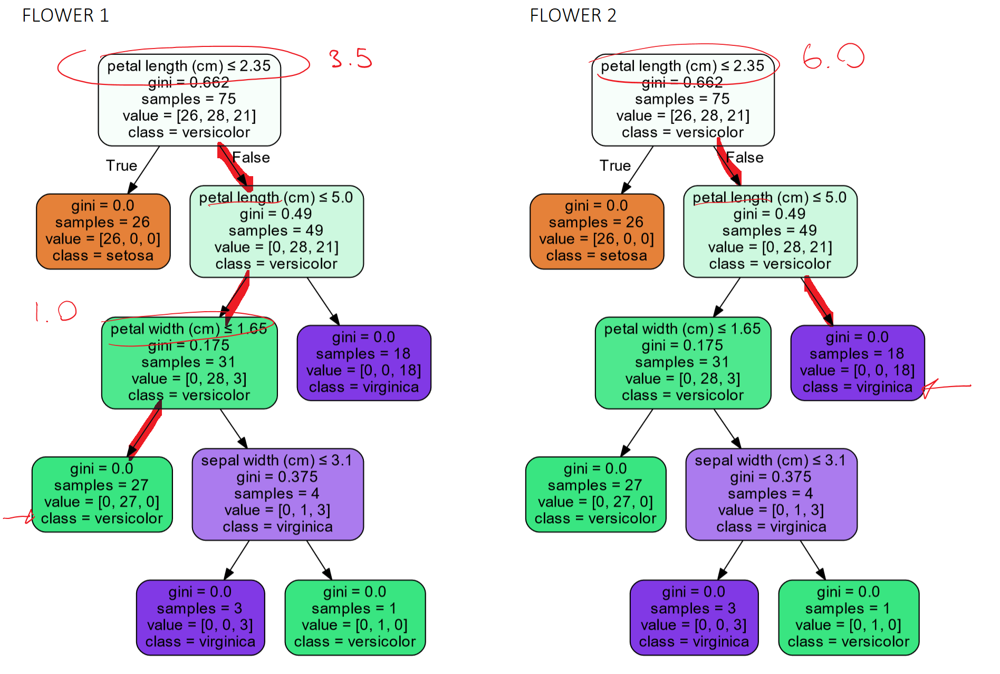
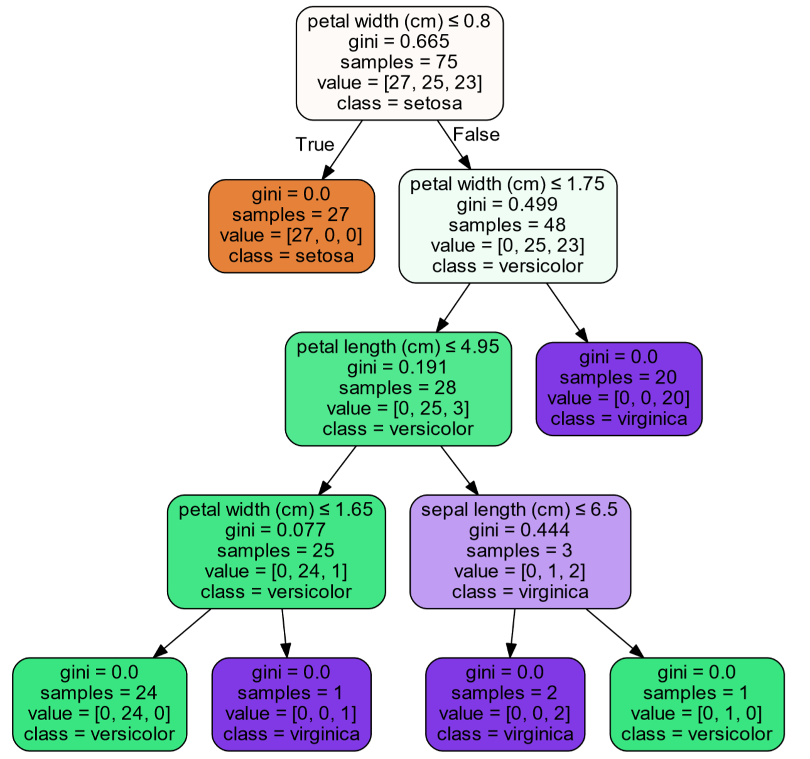
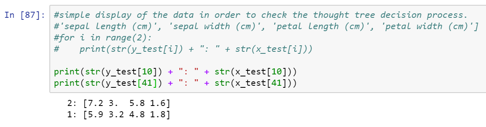
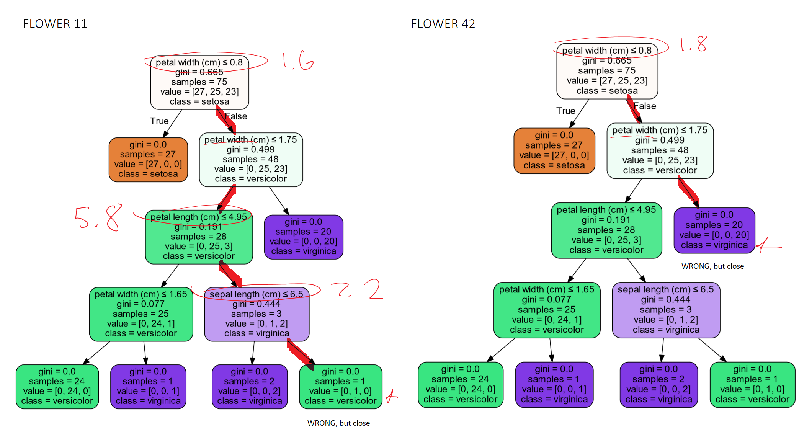

# Iris-Machine-Learning Example

This project exercises simple Machine Learning using the Iris dataset in using DecisionTreeClassifier, visualizing it, and then also creating two different classifiers of my own.

The classifiers that I create are:

* A Random Classifier, which simply selects a random label and uses that as the prediction.
* A Nearest Neighbor Classifier, which uses the Euclidean distance formula.
addition from a previous notebook

The accuracy score for the Decision tree classifier with the particular split that I obtained was 0.96, which is pretty good.
The accuracy score for the Nearest neighbor classifier that I built obtained was around 0.96 as well.

## Notes

The project was compiled in python 3.7

Graph visualizations were created using Graphviz

below are some photos of the charts created.

This is some data using strictly the decision tree classifier so we can visualize it with a graphviz tree
Running the split between the training and testing split once

### Example of a decision tree created from the classifier.

We will be analyzing the results that the classifier got **right** in trying to assign labels in order to analyze the thought process.

As you can see in flower 1 for the first split data, the decision was able to be made only by pedal length and pedal width, eventually leading to the versicolor decision (1). We can verify this by looking at looking at the chart output above when outputting the first element. 

Flower 2 is also properly assigned to virginica (2) simply by pedal length, because it has such big pedal length.

### This is a NEW decision tree created from the classifier, fed different training data.

This time we will be analyzing the results that the classifier got **wrong** in trying to assign labels in order to analyze the thought process.

As you can see, the decision tree has changed based on the new training data provided. Now instead of looking at pedal length first, we look at pedal width first, which is an interesting change. When looking at flower 11, we can see the thought process of the graph in selecting that it thinks the flower is a versicolor (1), when the flower is actually a virginica (2). Although the tree assigned the wrong label, it was pretty close. The second flower it would've chosen would've been virginica if it weren't versicolor.

When looking at the 42nd flower in the testing data, we can see that this also selected the wrong flower label. It wrongly guessed that it was virginica (2), but the flower was actually a versicolor (1). Although it chose incorrectly, the decision tree was still pretty close.
